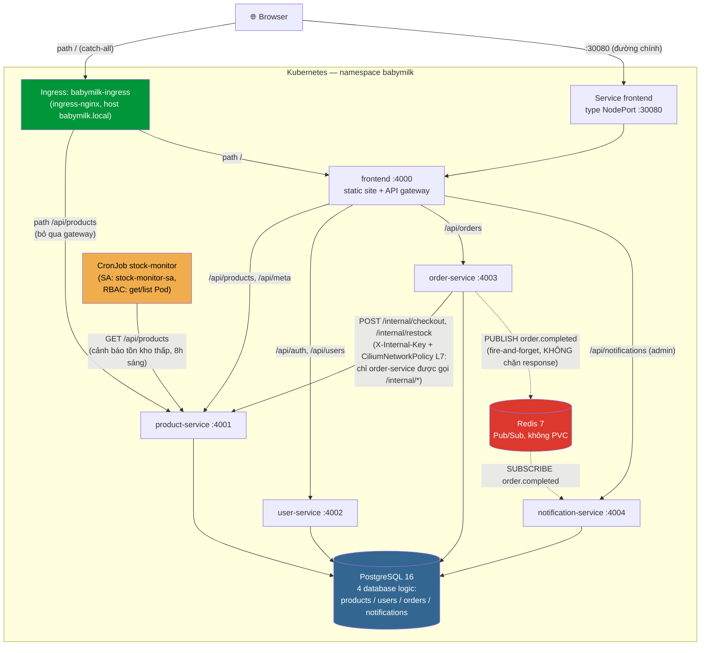
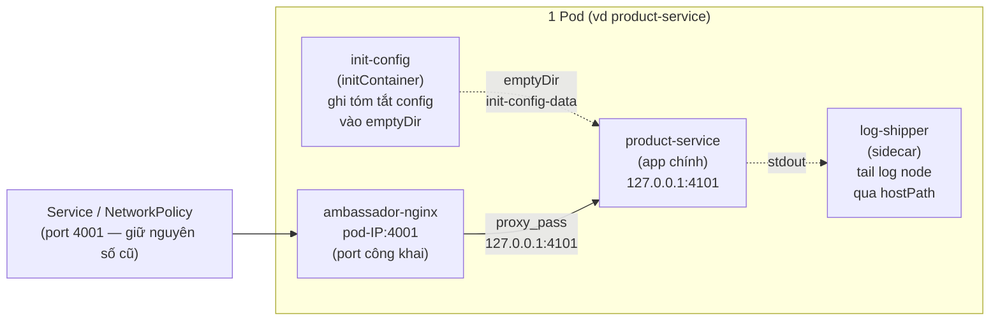

# Kiến trúc — BabyMilk Shop

## Sơ đồ luồng dữ liệu

**Đọc sơ đồ**: browser có 2 đường vào độc lập (NodePort là đường chính đang dùng cho demo; Ingress
minh hoạ path-based routing — path `/api/products` đi thẳng vào `product-service`, bỏ qua
`frontend`, còn lại route vào `frontend` như bình thường). `frontend` đóng vai trò **API gateway**
duy nhất mà browser cần biết (1 origin, không cần CORS) — nó tự proxy `/api/*` sang đúng backend
theo prefix path. `order-service` là consumer nội bộ DUY NHẤT được phép gọi `/internal/*` của
`product-service` (trừ/hoàn kho nguyên tử), enforce ở tầng L7 bằng CiliumNetworkPolicy — không phải
app tự kiểm tra. Đường nét đứt (`-.->`) là giao tiếp **bất đồng bộ** qua Redis Pub/Sub — khác hẳn
mọi mũi tên còn lại (HTTP đồng bộ): `order-service` PUBLISH xong là trả response ngay cho user,
KHÔNG chờ `notification-service` xử lý.

## Multi-container pod pattern (áp dụng cho cả 5 Deployment app)

Mỗi Pod trong `product-service`/`user-service`/`order-service`/`notification-service`/`frontend` có
**4 container**:

`init-config` chạy xong TRƯỚC (ghi vào `emptyDir`, app chính mount read-only đọc lại — minh hoạ init
container "chuẩn bị dữ liệu"). `log-shipper` đọc log qua `hostPath /var/log` (file kubelet tự ghi
trên node) — app **vẫn ghi log ra stdout bình thường**, không đổi gì (giữ đúng 12-Factor #11).
`ambassador-nginx` là container DUY NHẤT lắng nghe ở port công khai — app chính hoàn toàn không biết
gì về network bên ngoài pod, chỉ cần lắng nghe `127.0.0.1`.

Chi tiết đầy đủ (lý do thiết kế, bug gặp phải lúc build, cách fix): xem `k8s/CONVENTIONS.md` mục 3-4
và `README.md` mục "Multi-container pod pattern".

## Vì sao 1 Postgres instance thay vì 4 (database-per-service)

Đúng tinh thần microservices là mỗi service sở hữu database riêng — ở đây làm **schema-per-service**
trong CÙNG 1 Postgres instance (4 database logic: `babymilk_products`/`users`/`orders`/`notifications`,
mỗi service chỉ connect vào đúng 1 database của mình, không bao giờ query chéo) thay vì 4 Postgres
instance vật lý riêng biệt. Lý do: cluster chỉ có 1 node worker (~1.9 CPU / 3.2GB khả dụng vì node
master bị taint), 4 Postgres riêng sẽ tốn gấp nhiều lần RAM/CPU cho phần database mà không đổi được
gì về mặt cô lập dữ liệu (mỗi service vẫn không đọc/ghi chéo database của service khác — enforce
bằng `PGDATABASE` env riêng + Postgres user chỉ có quyền trên database của chính nó qua
`CREATE DATABASE` lúc khởi tạo, xem `k8s/base/50-postgres.yaml` ConfigMap `postgres-init`).

## Giao tiếp đồng bộ (HTTP) VÀ bất đồng bộ (Redis Pub/Sub)

**Đồng bộ (đa số luồng)**: HTTP REST, timeout 5s, service chết → trả `503` thay vì crash/treo.
Dùng cho mọi luồng cần phản hồi NGAY: catalog, auth, checkout (trừ kho + tạo đơn phải xong trước
khi trả response, người dùng cần biết ngay còn hàng hay không).

**Bất đồng bộ (1 luồng, có chủ đích)**: `order-service` PUBLISH event `order.completed` lên Redis
Pub/Sub ngay sau khi tạo đơn thành công — **fire-and-forget, không `await`**, Redis chậm/chết KHÔNG
được phép làm chậm hay fail response checkout (đã enforce bằng cách bọc lỗi publish chỉ log, không
throw — xem `services/order-service/src/eventPublisher.js`). `notification-service` SUBSCRIBE
channel này, "gửi" thông báo (ghi record + log, không SMTP thật) hoàn toàn tách rời khỏi luồng
checkout chính. Lý do chọn ĐÚNG bước này để làm async: gửi thông báo không phải điều user cần chờ
thấy ngay (khác với trừ kho — phải đồng bộ), và Pub/Sub (không phải queue bền) là đủ — mất 1 event
lúc subscriber đang restart là chấp nhận được, không cần đảm bảo delivery kiểu Kafka/RabbitMQ ở quy
mô demo này. `order-service` KHÔNG dùng Redis cho `/readyz` — dependency phụ trợ chết không được
làm mất readiness của luồng chính.

Nếu mở rộng thật (nhiều đơn hàng đồng thời, cần retry bền vững, nhiều consumer hơn), bước hợp lý
tiếp theo là chuyển Redis Pub/Sub sang message broker có persistence (RabbitMQ/Kafka) + outbox
pattern để không mất event khi consumer down dài hạn.
